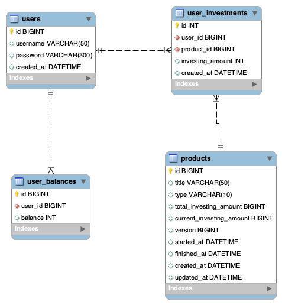

### 사용 기술

* Kotlin 1.5+
* Kotlin Coroutine, Coroutine-Flow
* Spring Boot
* Spring WebFlux
* Spring Data R2DBC
* Spring Data Reactive Redis
* Spring Boot Actuator
* Spring Cloud Sleuth (Slf4J MDC Context)
* Embedded Redis (Cache)
* Embedded H2DB


### Spring Rest Docs 문서 생성

`./gradlew clean build asciidoc`

* API 문서는 `investment-api/src/main/resources/static/docs` 하위에 생성됩니다.
* API 테스트를 위해 미리 생성한 문서는 `프로젝트 루트/docs`로 옮겨두었습니다.


### 데이터베이스 초기화 스크립트
 
`investment-api/src/main/resources/scripts`

* 데이터베이스 초기화 스크립트는 Spring Boot 애플리케이션 기동시 자동으로 동작합니다.
* schema.sql : 테이블 초기화 스크립트
* data.sql : 테이블 초기화 후 데이터 생성 스크립트


### 애플리케이션 관제를 위한 메트릭

`http://localhost:8080/actuator/metrics`


### 모듈 설명 

* investment-api
  * 스프링 환경 설정과 웹 서비스용 api 모듈
* investment-core
  * 공통 모듈, 공통 유틸리티
* investment-product-domain
  * 서비스 이하 상품 도메인 모듈 (entity, repository)
* investment-user-domain
  * 서비스 이하 유저 도메인 모듈 (entity, repository)  
* 모듈간 의존관계
```
\--- investment-api
     +--- investment-core
     +--- investment-product-domain
          +--- investment-core
     +--- investment-user-domain
          +--- investment-core          
```


### 핵심 문제해결 전략 및 분석 내용

* 전체 투자 상품 조회 API
    * 오늘 날짜 기준으로 모집기간내의 상품만 포함되야 하고 과거 또는 미래의 상품은 응답하지 않는다.
    * 조건에 맞는 전체 상품을 조회하는데 이때 사용자별 투자 이력을 가져온다.
    * 이때 n+1 쿼리가 발생하여 성능 하락이 발생할 여지가 있으므로 in 절로 DB 질의를 최소화 한다.

* 투자하기 API
    * 상세한 검증 로직이 필요하다. (상품이 유효한지, 잔액은 충분한지, 중복 투자는 아닌지)
    * 대용량 트래픽이 발생할 경우에도 SOLD_OUT 조건에 맞춰 투자가 진행되야한다.
    * 이를 보장하기 위해 분산 락 또는 데이터베이스의 락을 사용해야 한다.
    * 예제에서는 `@Version` 기반의 낙관적 락을 적용

* 나의 투자상품 조회 API
    * 사용자가 투자한 모든 내역을 반환한다.


### 투자 서비스 ERD

* users : 사용자 정보
* user_balances : 사용자가 보유한 잔액
* user_investments : 사용자의 투자 이력
* products : 투자 대상이 되는 상품 (부동산/신용)



